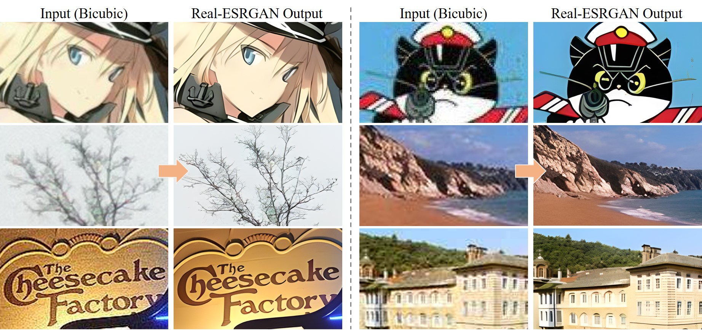

# nonebot_plugin_RealESRGAN

一个基于nonebot2的超分辨率重建插件

## 安装方法


- 使用pip安装

```
pip install nonebot_plugin_RealESRGAN
```

然后在项目内导入插件

```
nonebot.load_plugin('nonebot_plugin_RealESRGAN')
```

- 使用nb安装

```
nb plugin install nonebot_plugin_RealESRGAN
```

- 从github安装

先将源代码拉下来

```
https://github.com/ppxxxg22/nonebot_plugin_RealESRGAN
```

这种方式适合想自己做修改，这个项目结构挺简单的，注释也还算全，可以按照自己想要的方式进行修改。

## 效果及使用

### 效果

本插件是使用超分辨率来对图像进行重建，可以简单理解成让图片变大变清晰。

超分辨率原理是基于[这个仓库](https://github.com/xinntao/Real-ESRGAN)的，将此模型部署到线上后作为api来使用。效果如下。



感谢[AK391](https://github.com/AK391)通过[Gradio](https://github.com/gradio-app/gradio)添加到了[Huggingface Spaces](https://huggingface.co/spaces)（一个机器学习应用的在线平台）[Gradio在线版](https://huggingface.co/spaces/akhaliq/Real-ESRGAN)。**不过由于免费版额度似乎有限，为了不占用其额度，本插件使用的是自建的仓库作为api接口，当然，如果各位用户想要追求稳定性，也最好是用自己的账号自建一个来专门为自己使用，教程见[这里](docs/Huggingface%20Spaces教程.md)**


*不过，线上的模型似乎**没有本地推断那么好**，这个插件仅供**娱乐使用**，想要获得更好的重建效果，建议使用原仓库提供的程序。当然，我也对原仓库的程序做了简单的封装，需要的可以看[这里](docs/原仓库程序的封装及使用.md)*


### 使用

使用方法很简单，首先输入[`重建`, `real-esrgan`, `超分辨率重建`, `esrgan`, `real_esrgan`]中的任意一个来启动插件。注意这些都是命令格式，即需要以`/`或自定义的命令引导符开头。

然后输入[`base`, `anime`]中的一个来作为重建的类型，其中`base`相对适用于一般图片，而`anime`则对二刺螈图比较好，但也不绝对。

最后发送一张图片即可，但不能以文件形式发送。

~~当然你全部连起来输入也可以，不过我觉得这样不是很方便~~


之后bot会自动返回一张图或者是错误信息。

## 注意事项

- 不要上传过大的图，此插件仅供娱乐，太大的图不仅会导致远程服务器免费额度被大量占用，同时由于压图原因，也不会得到很好的重建结果。**当然如果有这方面的需求，可以去使用[本地程序](docs/原仓库程序的封装及使用.md)，调用本地算力可劲用**。
- 本插件返回的结果不代表原仓库的重建结果，**事实上，原仓库模型的重建结果是非常非常优秀的**。
- 最好还是自己去建一个Huggingface Spaces免费仓库来作为自己的api接口，可以查阅[这里](docs/Huggingface%20Spaces教程.md)。


## 后续任务

- 修bug(如果有的话)
- 可以在配置中指定使用的api(没错，目前你就算自建出了api也需要去源码里修改)，~~最近有点忙，希望有大佬提pr。~~