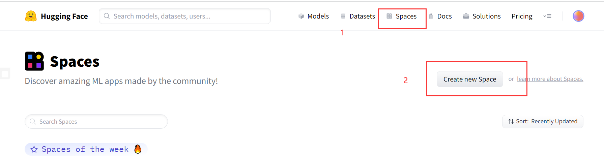
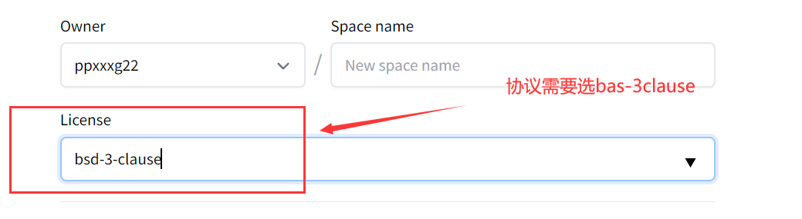

## Huggingface Spaces创建自己的API

1. 先去注册一个[账号](https://huggingface.co/)
2. 把原作者的仓库拉到本地，当然你拉我的也行。

```
# 原作者
git clone https://huggingface.co/spaces/akhaliq/Real-ESRGAN

# 这个是我的
git clone https://huggingface.co/spaces/ppxxxg22/Real-ESRGAN

```
3. 新建一个自己的space




然后创建仓库

4. 把你的仓库拉到本地

```

git clone https://huggingface.co/spaces/{你的id名}/{你的仓库名}

```

5. 把2中拉下的内容里除了.git文件夹外全部复制并替换掉你在4中拉下来的仓库

6. 把本地仓库推送到远程

```

git add .
git commit -m "push"
git push

```

等待远程构建完成，你就得到了你的api地址

https://hf.space/embed/{你的id名}/{你的仓库名}/api/predict/

目前需要在源码中替换api，在utils里把get_result函数里面的地址替换掉即可。