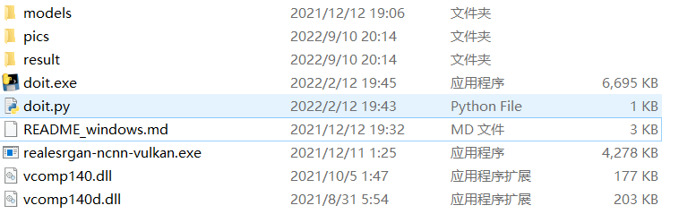
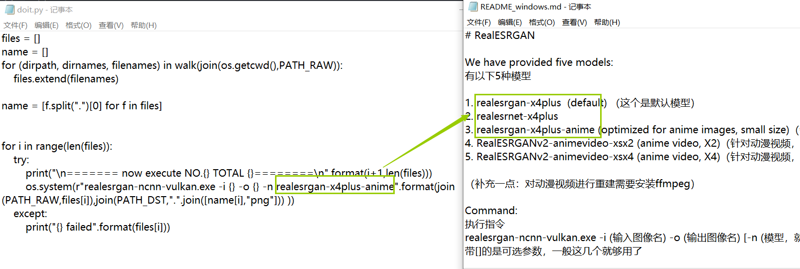

## 原仓库程序的封装及使用

首先，原仓库提供了[可执行文件](https://github.com/xinntao/Real-ESRGAN/blob/master/README_CN.md#%E4%BE%BF%E6%90%BA%E7%89%88%E7%BB%BF%E8%89%B2%E7%89%88%E5%8F%AF%E6%89%A7%E8%A1%8C%E6%96%87%E4%BB%B6)，不过这个**执行文件不仅名字很长**，而且其**参数也很长**，更何况我们需要超分辨率重建的图片往往都是保存或下载的，所以**图片名字更是长的离谱**，导致每次我们输入指令都是形如这种的鬼东西`realesrgan-ncnn-vulkan.exe -i 0DF53FEF9DD2C727B87800E7D778E6B1.png -o result.png -n realesrgan-x4plus-anime`。

而且一般大家都是对二刺螈图片进行重建，所以我用写了一个脚本进行封装，解压release中的文件后，你可以看到这样一个目录结构。

使用方法是将**需要重建的所有图片**全部放入pics文件夹中，然后执行`doit.exe`或者是`doit.py`即可，所有被重建后的图片会放入result文件夹中。

**每次会对pics文件夹中的所有图片进行重建，所以请在pics中只保留当此需要被重建的图片。**

其中`doit.py`是脚本的源文件，`doit.exe`是打包后的文件，可以在其中自由更改重建的模型，至于如何更改，请查阅当前目录下的`README_windows.md`文件(我翻译了一部分)。

其实只需要将左侧中`doit.py`种的-n的参数替换成右侧里面这三个就可以了

